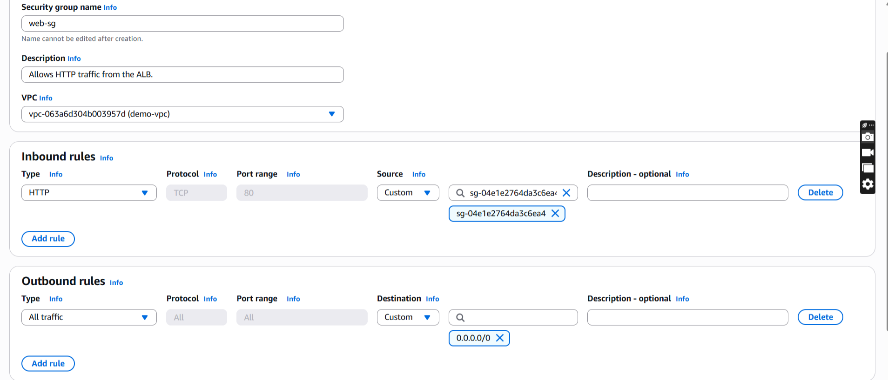

### Step 1

A VPC is a virtual network that closely resembles a traditional network that you'd operate in your own data center. After you create a VPC, you can add subnets.

As you can see in the screenshot:

- A custom Virtual Private Cloud (VPC) was created with an IPv4 CIDR block of
  `10.0.0.0/16`.

 

 

---

### Step 2

A subnet is a range of IP addresses in your VPC. A subnet must reside in a single Availability Zone. After you add subnets, you can deploy AWS resources in your VPC.

As shown in the screenshot:

1. Filtered by VPC and selected the custom VPC **`demo-vpc`** created for the project.
2. Created two public subnets:

   - **`PublicSubnetA`** in Availability Zone **`eu-west-2a`** with Subnet CIDR block **`10.0.0.0/24`**
   - **`PublicSubnetB`** in Availability Zone **`eu-west-2b`** with Subnet CIDR block **`10.0.1.0/24`**

   These Subnet CIDR blocks were chosen so that the subnets do not overlap, while remaining within the VPC CIDR block **`10.0.0.0/16`**

 

 

---

### Step 3

As shown in the screenshot:

Created two private subnets:

- **`PrivateSubnetA`** in Availability Zone **`eu-west-2a`** with Subnet CIDR block **`10.0.16.0/20`**
- **`PrivateSubnetB`** in Availability Zone **`eu-west-2b`** with Subnet CIDR block **`10.0.32.0/20`**

These Subnet CIDR blocks were chosen so that the subnets do not overlap, while remaining within the VPC CIDR block **`10.0.0.0/16`**

 

 

---

### Step 4

A gateway connects your VPC to another network. Here you are dealing with an internet gateway. An internet gateway is a virtual router that connects a VPC to the internet.

As you can see in these screenshots:

- Created an internet gateway called `demo-igw` (1) and then attached the internet gateway to the custom VPC (2,3) called `demo-vpc`. This way you enable the VPC to communicate with the internet.

 

 

---

### Step 5

Route tables determine where network traffic from your subnet or gateway is directed.

As can be seen in the screenshot:

- Created `PublicRouteTable` and added `demo-vpc` as the vpc to use for the `PublicRouteTable`. The `PublicRouteTable` will later on be associated with `PublicSubnetA` and `PublicSubnetB`.

 

 

---

### Step 6

Route tables determine where network traffic from your subnet or gateway is directed.

As can be seen in the screenshot:

- Created `PrivateRouteTable-A` and added `demo-vpc` as the vpc to use for the `PrivateRouteTable-A`. The `PrivateRouteTable-A` will later on be associated with `PrivateSubnetA`.
- Created `PrivateRouteTable-B` and added `demo-vpc` as the vpc to use for the `PrivateRouteTable-B`. The `PrivateRouteTable-B` will later on be associated with `PrivateSubnetB`.

 

 

---

### Step 7

Each subnet must be associated with a route table, which specifies the allowed routes for outbound traffic leaving the subnet.

Updated subnet associations for `PublicRouteTable`.
Here, `PublicSubnetA` and `PublicSubnetB` are being associated with the `PublicRouteTable`.

 

 

---

### Step 8

Each subnet must be associated with a route table, which specifies the allowed routes for outbound traffic leaving the subnet.

Updated subnet associations for `PrivateRouteTable-A`.
Here, `PrivateSubnetA` is being associated with the `PrivateRouteTable-A`.

 

 

---

### Step 9

Each subnet must be associated with a route table, which specifies the allowed routes for outbound traffic leaving the subnet.

Updated subnet associations for `PrivateRouteTable-B`.
Here, `PrivateSubnetB` is being associated with the `PrivateRouteTable-B`.

 

 

---

### Step 10

After creating a subnet, you can modify the auto-assign IP settings by selecting `Enable auto-assign public IPv4 address` . This setting will give any new EC2 instance you launch in `PublicSubnetA` automatically a public IP address.

 

 

---

### Step 11

After creating a subnet, you can modify the auto-assign IP settings by selecting `Enable auto-assign public IPv4 address` . This setting will give any new EC2 instance you launch in `PublicSubnetB` automatically a public IP address.

 

 

---

### Step 12

The `PublicRouteTable` is the route table for `PublicSubnetA` and `PublicSubnetB`. The `PublicRouteTable` must have a route that sends internet traffic to the internet gateway.

As can be seen in the screenshots, updated the `PublicRouteTable` by adding a route that sends the internet traffic to the demo-igw (demo internet gateway) that was created in step 4.

 

 

---

### Step 13

Created a NAT gateway called `NATGW-A` in `PublicSubnetA`.

Although the internet cannot establish connections with the EC2 instance in `PrivateSubnetA`, the public
NAT Gateway called `NATGW-A` in `PublicSubnetA` will enable the EC2 instance in `PrivateSubnetA` to send outbound traffic to the internet.

It is recommended to use at least one NAT Gateway in each Availability Zone where you run a workload.
A dedicated NAT Gateway in each Availability Zone lets you route traffic within the same Availability Zone so you do not pay for inter-AZ Data Transfer.

Furthermore, when considering resiliency, it optimises your fault tolerance in an event of Availability Zone failure.

 

 

---

### Step 14

The `PrivateRouteTable-A` is the route table for `PrivateSubnetA`. The `PrivateRouteTable-A` must have a route that sends internet traffic to the NAT gateway, in this case `NATGW-A`.

As can be seen in the screenshots, updated the route table `PrivateRouteTable-A` of the private subnet called `PrivateSubnetA` to direct traffic to the NAT Gateway called `NATGW-A`.

This allows the EC2 instance in the private subnet to initiate outbound internet connections while remaining unreachable directly from the internet.

 

 

---

### Step 15

Created a NAT gateway called `NATGW-B` in `PublicSubnetB`.

Although the internet cannot establish connections with the EC2 instance in `PrivateSubnetB`, the public
NAT Gateway called `NATGW-B` in `PublicSubnetB` will enable the EC2 instance in `PrivateSubnetB` to send outbound traffic to the internet.

It is recommended to use at least one NAT Gateway in each Availability Zone where you run a workload.
A dedicated NAT Gateway in each Availability Zone lets you route traffic within the same Availability Zone so you do not pay for inter-AZ Data Transfer.

Furthermore, when considering resiliency, it optimises your fault tolerance in an event of Availability Zone failure.

 

 

---

### Step 16

The `PrivateRouteTable-B` is the route table for `PrivateSubnetB`. The `PrivateRouteTable-B` must have a route that sends internet traffic to the NAT gateway, in this case `NATGW-B`.

As can be seen in the screenshots, updated the route table `PrivateRouteTable-B` of the private subnet called `PrivateSubnetB` to direct traffic to the NAT Gateway called `NATGW-B`.

This allows the EC2 instance in the private subnet to initiate outbound internet connections while remaining unreachable directly from the internet.

 

 

---

### Step 17

Created the security group demo-lb-sg for the Application Load Balancer (ALB). This security group allows inbound HTTP traffic on port 80 and HTTPS traffic on port 443 from the internet (0.0.0.0/0)

 

 

---

### Step 18

Created a target group called `demo-tg`. This target group route requests to individual registered targets, in this case the EC2 instance in `PrivateSubnetA` and `PrivateSubnetB`, using the protocol `HTTP` and the port number `80`, as can be seen in the screenshot.

So the Application Load Balancer (ALB), routes requests to the EC2 instances we have just mentioned, by using the protocol and port number that were specified when the target group was created, as can be seen in the screenshot.

 

 

---

### Step 19

Although, there are the protocol versions HTTP/2 and gRPC, but by default the Application Load Balancer sends requests to targets using HTTP/1.1 and therefore the protocol version `HTTP/1.1` was selected, as can be seen in the screenshot.

The Application Load Balancer periodically sends requests to its registered targets to test their status. These tests are called health checks.

The health check settings have been configured to have `HTTP` for the `Health check protocol` setting. So in this case the Application Load Balancer used the default `HTTP` protocol when performing health checks on the EC2 instances. The HTTP GET method is used here, to send health check requests.
The `HTTP` protocol uses the HTTP GET method to send health check requests.

Furthermore, `/` was used for the `Health check path` setting. Since we used protocol version HTTP/1.1, the default is `/` for the `Health check path` setting.

 

 

---

### Step 20

Click on Next and then on the next page, click on Create target group.

 

 

 

 

---

### Step 21

Created an internet-facing Application Load Balancer (that can be accessed from the internet) called `demo-alb` and in the Network mapping section, the `demo-vpc` was chosen, meaning that the Application Load Balancer (ALB) will
exist and scale within the `demo-vpc`.

 

 

---

### Step 22

Since the internet-facing Application Load Balancer is being used here, the public subnets `PublicSubnetA` and `PublicSubnetB` have been selected, in order for the EC2 instances in the private subnets to receive traffic from the Application Load Balancer.

 

 

---

### Step 23

The listener rule `http:80` in this case, determines how the Application Load Balancer routes requests to `demo-tg`.

A listener is a process that checks for connection requests, using the protocol (in this case: `http`) and port (in this case: `80`) that you configure.

 

 

---

### Step 24

Created a security group called `web-sg` for the EC2 instance in `PrivateSubnetA` and the EC2 instance in `PrivateSubnetB`. The security group only allows HTTP traffic from the Application Load Balancer and that's why for the inbound rule `HTTP` was chosen as `type` and the Application Load Balancer's security group was chosen as `source`.

 

 

---

### Step 25

Before you can create an Auto Scaling group using a launch template, you must create a launch template that contains the configuration information to launch an instance.

a. A launch template called `MyTemplate` was created.

 

 
 

b. An Amazon Machine Image was chosen. It includes an Image ID.

 

 
 

c. Instance type `t2.micro` was used and key pair `loadbalancer` was created.

 

 
 

d. Security group web-sg was selected.

 

 
 

e. At the bottom of the page, under section `Advanced details` , a script that installs the Apache web server was copied into the `user data` section.

 

 
 
