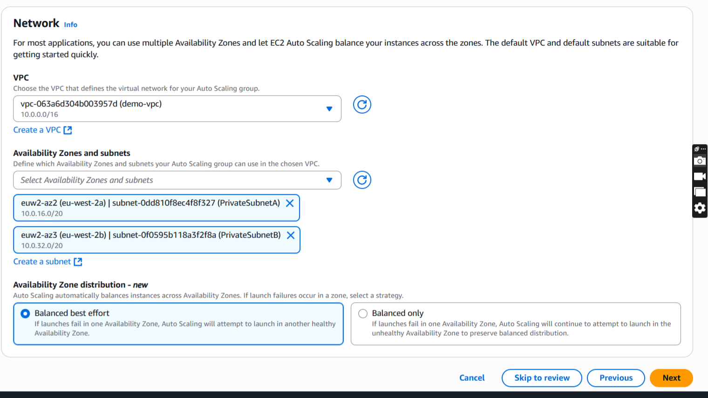
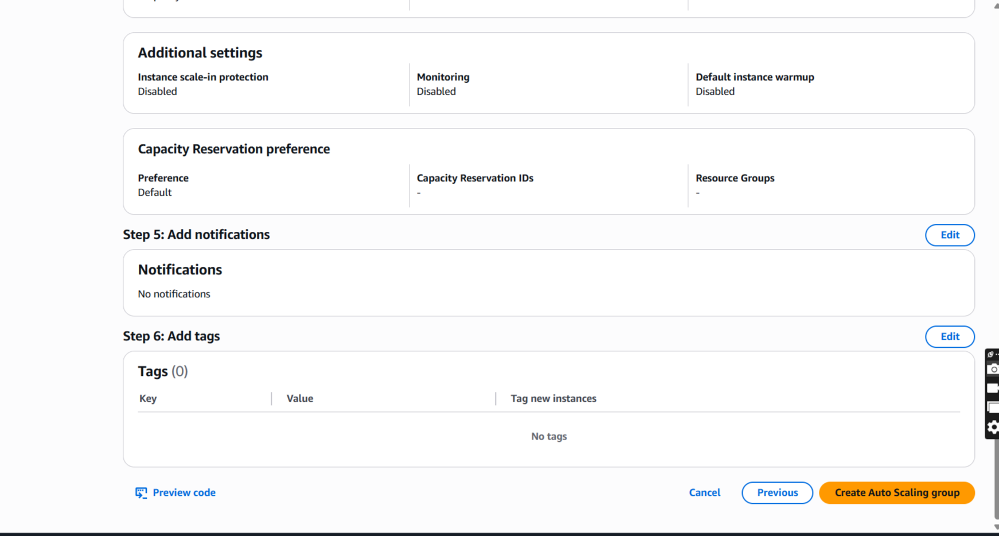
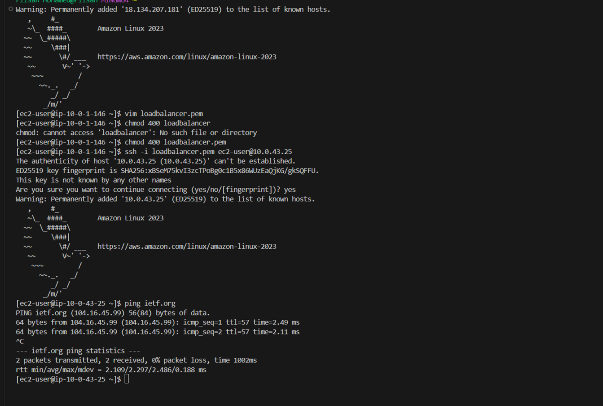

## Project Summary

Created a custom Virtual Private Cloud (VPC) in AWS with both public and private subnets spread across two Availability Zones for high availability. The public subnets connect to the internet through an Internet Gateway, while the private subnets use a NAT Gateway to allow the EC2 instances in the private subnets to initiate outbound internet connections while remaining unreachable directly from the internet. A launch template was created, auto scaling was used and 2 EC2 instances were automatically launched in `PrivateSubnetA` and `PrivateSubnetB`. The Application Load Balancer was set up to forward traffic to the EC2 instances running in the private subnets. Also configured an HTTPS listener with a valid SSL certificate and created a bastion-host (EC2 instance) temporarily in the public subnet, to check if the NAT gateway in both public subnets are working and whether the EC2 instances in the private subnets can initiate outbound internet connections.

 

---

### Architecture diagram

### Step 1

A VPC is a virtual network that closely resembles a traditional network that you'd operate in your own data center. After you create a VPC, you can add subnets.

As you can see in the screenshot:

- A custom Virtual Private Cloud (VPC) was created with an IPv4 CIDR block of
  `10.0.0.0/16`.

 

 

---

### Step 2

A subnet is a range of IP addresses in your VPC. A subnet must reside in a single Availability Zone. After you add subnets, you can deploy AWS resources in your VPC.

As shown in the screenshot:

1. Filtered by VPC and selected the custom VPC **`demo-vpc`** created for the project.
2. Created two public subnets:

   - **`PublicSubnetA`** in Availability Zone **`eu-west-2a`** with Subnet CIDR block **`10.0.0.0/24`**
   - **`PublicSubnetB`** in Availability Zone **`eu-west-2b`** with Subnet CIDR block **`10.0.1.0/24`**

   These Subnet CIDR blocks were chosen so that the subnets do not overlap, while remaining within the VPC CIDR block **`10.0.0.0/16`**

 

 

---

### Step 3

As shown in the screenshot:

Created two private subnets:

- **`PrivateSubnetA`** in Availability Zone **`eu-west-2a`** with Subnet CIDR block **`10.0.16.0/20`**
- **`PrivateSubnetB`** in Availability Zone **`eu-west-2b`** with Subnet CIDR block **`10.0.32.0/20`**

These Subnet CIDR blocks were chosen so that the subnets do not overlap, while remaining within the VPC CIDR block **`10.0.0.0/16`**

 

 

---

### Step 4

A gateway connects your VPC to another network. Here you are dealing with an internet gateway. An internet gateway is a virtual router that connects a VPC to the internet.

As you can see in these screenshots:

- Created an internet gateway called `demo-igw` (1) and then attached the internet gateway to the custom VPC (2,3) called `demo-vpc`. This way you enable the VPC to communicate with the internet.

 

 

---

### Step 5

Route tables determine where network traffic from your subnet or gateway is directed.

As can be seen in the screenshot:

- Created `PublicRouteTable` and added `demo-vpc` as the vpc to use for the `PublicRouteTable`. The `PublicRouteTable` will later on be associated with `PublicSubnetA` and `PublicSubnetB`.

 

 

---

### Step 6

Route tables determine where network traffic from your subnet or gateway is directed.

As can be seen in the screenshot:

- Created `PrivateRouteTable-A` and added `demo-vpc` as the vpc to use for the `PrivateRouteTable-A`. The `PrivateRouteTable-A` will later on be associated with `PrivateSubnetA`.
- Created `PrivateRouteTable-B` and added `demo-vpc` as the vpc to use for the `PrivateRouteTable-B`. The `PrivateRouteTable-B` will later on be associated with `PrivateSubnetB`.

 

 

---

### Step 7

Each subnet must be associated with a route table, which specifies the allowed routes for outbound traffic leaving the subnet.

Updated subnet associations for `PublicRouteTable`.
Here, `PublicSubnetA` and `PublicSubnetB` are being associated with the `PublicRouteTable`.

 

 

---

### Step 8

Each subnet must be associated with a route table, which specifies the allowed routes for outbound traffic leaving the subnet.

Updated subnet associations for `PrivateRouteTable-A`.
Here, `PrivateSubnetA` is being associated with the `PrivateRouteTable-A`.

 

 

---

### Step 9

Each subnet must be associated with a route table, which specifies the allowed routes for outbound traffic leaving the subnet.

Updated subnet associations for `PrivateRouteTable-B`.
Here, `PrivateSubnetB` is being associated with the `PrivateRouteTable-B`.

 

 

---

### Step 10

After creating a subnet, you can modify the auto-assign IP settings by selecting `Enable auto-assign public IPv4 address` . This setting will give any new EC2 instance you launch in `PublicSubnetA` automatically a public IP address.

 

 

---

### Step 11

After creating a subnet, you can modify the auto-assign IP settings by selecting `Enable auto-assign public IPv4 address` . This setting will give any new EC2 instance you launch in `PublicSubnetB` automatically a public IP address.

 

 

---

### Step 12

The `PublicRouteTable` is the route table for `PublicSubnetA` and `PublicSubnetB`. The `PublicRouteTable` must have a route that sends internet traffic to the internet gateway.

As can be seen in the screenshots, updated the `PublicRouteTable` by adding a route that sends the internet traffic to the demo-igw (demo internet gateway) that was created in step 4.

 

 

---

### Step 13

Created a NAT gateway called `NATGW-A` in `PublicSubnetA`.

Although the internet cannot establish connections with the EC2 instance in `PrivateSubnetA`, the public
NAT Gateway called `NATGW-A` in `PublicSubnetA` will enable the EC2 instance in `PrivateSubnetA` to send outbound traffic to the internet.

It is recommended to use at least one NAT Gateway in each Availability Zone where you run a workload.
A dedicated NAT Gateway in each Availability Zone lets you route traffic within the same Availability Zone so you do not pay for inter-AZ Data Transfer.

Furthermore, when considering resiliency, it optimises your fault tolerance in an event of Availability Zone failure.

 

 

---

### Step 14

The `PrivateRouteTable-A` is the route table for `PrivateSubnetA`. The `PrivateRouteTable-A` must have a route that sends internet traffic to the NAT gateway, in this case `NATGW-A`.

As can be seen in the screenshots, updated the route table `PrivateRouteTable-A` of the private subnet called `PrivateSubnetA` to direct traffic to the NAT Gateway called `NATGW-A`.

This allows the EC2 instance in the private subnet to initiate outbound internet connections while remaining unreachable directly from the internet.

 

 

---

### Step 15

Created a NAT gateway called `NATGW-B` in `PublicSubnetB`.

Although the internet cannot establish connections with the EC2 instance in `PrivateSubnetB`, the public
NAT Gateway called `NATGW-B` in `PublicSubnetB` will enable the EC2 instance in `PrivateSubnetB` to send outbound traffic to the internet.

It is recommended to use at least one NAT Gateway in each Availability Zone where you run a workload.
A dedicated NAT Gateway in each Availability Zone lets you route traffic within the same Availability Zone so you do not pay for inter-AZ Data Transfer.

Furthermore, when considering resiliency, it optimises your fault tolerance in an event of Availability Zone failure.

 

 

---

### Step 16

The `PrivateRouteTable-B` is the route table for `PrivateSubnetB`. The `PrivateRouteTable-B` must have a route that sends internet traffic to the NAT gateway, in this case `NATGW-B`.

As can be seen in the screenshots, updated the route table `PrivateRouteTable-B` of the private subnet called `PrivateSubnetB` to direct traffic to the NAT Gateway called `NATGW-B`.

This allows the EC2 instance in the private subnet to initiate outbound internet connections while remaining unreachable directly from the internet.

 

 

---

### Step 17

Created the security group demo-lb-sg for the Application Load Balancer (ALB). This security group allows inbound HTTP traffic on port 80 and HTTPS traffic on port 443 from the internet (0.0.0.0/0)

 

 

---

### Step 18

First left the VPC section in the AWS console (the VPC console) and went to the EC2 section in the AWS console (the EC2 Console). In the EC2 console, created a target group called `demo-tg`. This target group routes requests to individual registered targets, in this case the EC2 instance in `PrivateSubnetA` and `PrivateSubnetB`.

So the Application Load Balancer (ALB), routes requests to the EC2 instances we have just mentioned, by using the protocol `HTTP` and port number `80` that were specified when the target group was created, as can be seen in the screenshot.

 

 

---

### Step 19

Although, there are the protocol versions HTTP/2 and gRPC, but by default the Application Load Balancer sends requests to targets using HTTP/1.1 and therefore the protocol version `HTTP/1.1` was selected, as can be seen in the screenshot.

The Application Load Balancer periodically sends requests to its registered targets to test their status. These tests are called health checks.

The health check settings have been configured to have `HTTP` for the `Health check protocol` setting. So in this case the Application Load Balancer used the default `HTTP` protocol when performing health checks on the EC2 instances. The HTTP GET method is used here, to send health check requests.
The `HTTP` protocol uses the HTTP GET method to send health check requests.

Furthermore, `/` was used for the `Health check path` setting. Since we used protocol version HTTP/1.1, the default is `/` for the `Health check path` setting.

 

 

---

### Step 20

Click on Next and then on the next page, click on Create target group.

 

 

 

 

---

### Step 21

Stayed in the EC2 section in the AWS Console and created an internet-facing Application Load Balancer (that can be accessed from the internet) called `demo-alb` and in the Network mapping section, the `demo-vpc` was chosen, meaning that the Application Load Balancer (ALB) will
exist and scale within the `demo-vpc`.

 

 

---

### Step 22

Since the internet-facing Application Load Balancer is being used here, the public subnets `PublicSubnetA` and `PublicSubnetB` have been selected, in order for the EC2 instances in the private subnets to receive traffic from the Application Load Balancer.

 

 

---

### Step 23

The listener rule `http:80` in this case, determines how the Application Load Balancer routes requests to `demo-tg`.

A listener is a process that checks for connection requests, using the protocol (in this case: `http`) and port (in this case: `80`) that you configure.

 

 

---

### Step 24

Went to the VPC section in the AWS Console (the VPC Console) and created a security group called `web-sg` for the EC2 instance in `PrivateSubnetA` and the EC2 instance in `PrivateSubnetB`. The security group only allows HTTP traffic from the Application Load Balancer and that's why for the inbound rule `HTTP` was chosen as `type` and the Application Load Balancer's security group was chosen as `source`.

The security group `web-sg` must allow access from the load balancer on both the listener port (usually port 80 for HTTP traffic) and the port that you want Elastic Load Balancing to use for health checks (as can be seen in step 19 when creating the target group, under `health checks`, the `health check protocol` is HTTP, which is port 80).

 

 

---

### Step 25

Went back to the EC2 section in the AWS Console (the EC2 Console) and created a launch template.

Before you can create an Auto Scaling group using a launch template, you must create a launch template that contains the configuration information to launch an instance.

a. A launch template called `MyTemplate` was created.

 

 
 

b. An Amazon Machine Image was chosen. It includes an Image ID.

 

 
 

c. Instance type `t2.micro` was used and key pair `loadbalancer` was created.

 

 
 

d. Security group web-sg was selected.

 

 
 

e. At the bottom of the page, under section `Advanced details` , a script that installs the Apache web server was copied into the `user data` section.

 

 
 

---

### Step 26

Stayed in the EC2 section in the AWS Console (the EC2 Console) and created an Auto Scaling Group.

a. An auto scaling group called `my-auto-scaling-group` was created.
The launch template called `MyTemplate` that was created in the previous step (step 25) was chosen and all its details came up
such as the AMI ID and the security group ID etc.

 

 
 

 
 

b. Chose the custom vpc that was used which was in this case `vpc-demo`. The Auto Scaling group must be created in the same VPC as the security group (`web-sg` as you can see in step 25d) you specified in your launch template.

Furthermore, since the intention was to create one EC2 instance in `PrivateSubnetA` and one EC2 instance in `PrivateSubnetB`,in the network section under Availability Zones and subnets, `PrivateSubnetA` and `PrivateSubnetB` were selected.

If you're using private subnets, you can allow the Auto Scaling instances to access the internet by using a public NAT gateway. That's why there is `NATGW-A` in the `PublicSubnetA` and `NATGW-B` in the `PublicSubnetB`.

 

 
 

c. Here, attached the auto-scaling group to the load balancer and specified a target group by selecting `Attach to an existing load balancer` and then selecting `Choose from your load balancer target groups` and selecting the target group `demo-tg` that was created from step 18 to step 20.

So, EC2 instances that are launched by your Auto Scaling group are automatically registered with the load balancer. Likewise, instances that are terminated by your Auto Scaling group are automatically deregistered from the load balancer.

 

 
 

d.

In the first screenshot, you can see that the EC2 health checks are always enabled.

In the second screenshot, selected `Turn on Elastic Load Balancing health checks`, so that Amazon EC2 Auto Scaling can identify and replace unhealthy instances based on these additional health checks.

 

 
 

 
 

e. A scaling policy is not needed here, because this auto scaling group will maintain a fixed number of EC2 instances, which is in this case to keep always 2 EC2 instances running.

 

 
 

f. Keep everything else the way it is (default).

 

 
 

g. Click on skip to review, review it and then click on `Create Auto Scaling Group`.

 

 
 

 
 

 
 

 
 

 
 

---

### Step 27

Verified whether the Application Loadbalancer was attached by taking these steps.

a. If you click on the auto scaling group that you created (which is in this case `my-auto-scaling-group`) and you then click on the `integrations` tab, you can see under `load balancing ` the attached `load balancer target groups`, which is in this case `demo-tg`.

 

 
 

b. If you click on the `Activity tab`, you can verify that your instances were launched successfully. Here, you can see that the `status` column shows that the Auto Scaling group has successfully launched the EC2 instances

 

 
 

c. As you can see , under the `Instance management` tab, you can see that the instances are ready to receive traffic because under `lifecycle` its state says `inService`. Furthermore, under the `Health Status` column it says `Healthy`. The Health status column shows the result of the Amazon EC2 Auto Scaling health checks on your instances. Although an instance may be marked as healthy, the load balancer will only send traffic to instances that pass the load balancer health checks.

 

 
 

d. Opened the `Target groups` page (under `Load Balancing`) of the Amazon EC2 console, selected the target group `demo-tg` and clicked on the `targets` tab.

Since the `Health status` of the instances here shows as `Healthy`, the instances have been registered.
If the state of the instances would have been `initial`, it would have been probably because they are still in the process of being registered or still undergoing health checks. However, here the state of the instances is `Healthy`, so the instances are ready for use.

Verified that the instances were registered with the load balancer.

 

 
 

---

### Step 28

a. Configured an HTTPS listener with a valid SSL certificate.

 

 
 
b. Everytime the page is refreshed, you see one of the 2 EC2 instances' private ip address on the page.

 

 
 

 

---

### Step 29

Also checked whether both private instances in the private subnets were able to initiate outbound connectivity through the NAT Gateway they share an availability zone with, by temporarily putting a bastion in Public Subnet A and Public Subnet B. SSH’d into both Bastion-A and Bastion-B and then ssh'd into the private instances and in both cases, both private instances were able to initiate internet connectivity successfully as you can see in the pictures below.

 

 

 

 

 

 

 

 

 

 

 

