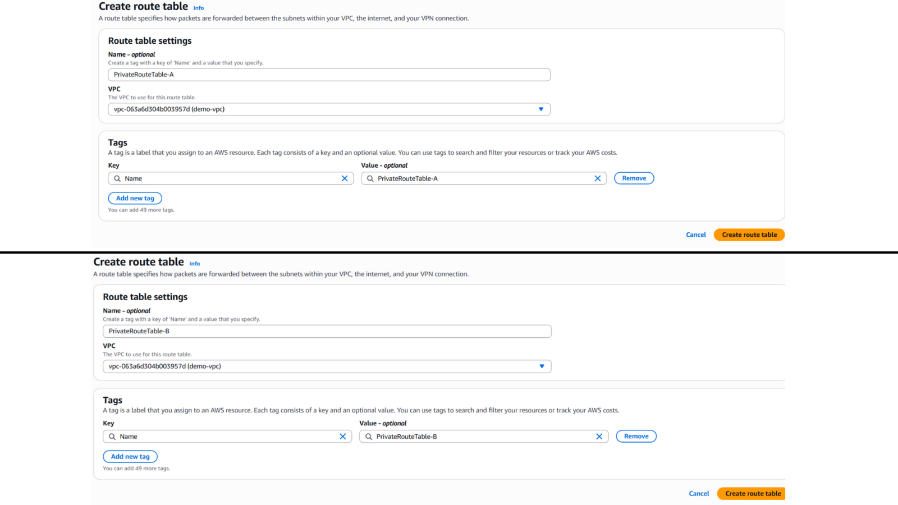

### Step 1

A VPC is a virtual network that closely resembles a traditional network that you'd operate in your own data center. After you create a VPC, you can add subnets.

As you can see in the screenshot:

- A custom Virtual Private Cloud (VPC) was created with an IPv4 CIDR block of
  `10.0.0.0/16`.

 

 

---

### Step 2

A subnet is a range of IP addresses in your VPC. A subnet must reside in a single Availability Zone. After you add subnets, you can deploy AWS resources in your VPC.

As shown in the screenshot:

1. Filtered by VPC and selected the custom VPC **`demo-vpc`** created for the project.
2. Created two public subnets:

   - **`PublicSubnetA`** in Availability Zone **`eu-west-2a`** with Subnet CIDR block **`10.0.0.0/24`**
   - **`PublicSubnetB`** in Availability Zone **`eu-west-2b`** with Subnet CIDR block **`10.0.1.0/24`**

   These Subnet CIDR blocks were chosen so that the subnets do not overlap, while remaining within the VPC CIDR block **`10.0.0.0/16`**

 

 

---

### Step 3

As shown in the screenshot:

Created two private subnets:

- **`PrivateSubnetA`** in Availability Zone **`eu-west-2a`** with Subnet CIDR block **`10.0.16.0/20`**
- **`PrivateSubnetB`** in Availability Zone **`eu-west-2b`** with Subnet CIDR block **`10.0.32.0/20`**

These Subnet CIDR blocks were chosen so that the subnets do not overlap, while remaining within the VPC CIDR block **`10.0.0.0/16`**

 

 

---

### Step 4

A gateway connects your VPC to another network. Here you are dealing with an internet gateway. An internet gateway is a virtual router that connects a VPC to the internet.

As you can see in these screenshots:

- Created an internet gateway called `demo-igw` (1) and then attached the internet gateway to the custom VPC (2,3) called `demo-vpc`. This way you enable the VPC to communicate with the internet.

 

 

---

### Step 5

Route tables determine where network traffic from your subnet or gateway is directed.

As can be seen in the screenshot:

- Created `PublicRouteTable` and added `demo-vpc` as the vpc to use for the `PublicRouteTable`. The `PublicRouteTable` will later on be associated with `PublicSubnetA` and `PublicSubnetB`.

 

 

---

### Step 6

Route tables determine where network traffic from your subnet or gateway is directed.

As can be seen in the screenshot:

- Created `PrivateRouteTable-A` and added `demo-vpc` as the vpc to use for the `PrivateRouteTable-A`. The `PrivateRouteTable-A` will later on be associated with `PrivateSubnetA`.
- Created `PrivateRouteTable-B` and added `demo-vpc` as the vpc to use for the `PrivateRouteTable-B`. The `PrivateRouteTable-B` will later on be associated with `PrivateSubnetB`.

 

 

---

### Step 7

Each subnet must be associated with a route table, which specifies the allowed routes for outbound traffic leaving the subnet.

Updated subnet associations for `PublicRouteTable`.
Here, `PublicSubnetA` and `PublicSubnetB` are being associated with the `PublicRouteTable`.

 

 

---

### Step 8

Each subnet must be associated with a route table, which specifies the allowed routes for outbound traffic leaving the subnet.

Updated subnet associations for `PrivateRouteTable-A`.
Here, `PrivateSubnetA` is being associated with the `PrivateRouteTable-A`.

 

 

---

### Step 9

Each subnet must be associated with a route table, which specifies the allowed routes for outbound traffic leaving the subnet.

Updated subnet associations for `PrivateRouteTable-B`.
Here, `PrivateSubnetB` is being associated with the `PrivateRouteTable-B`.

 

 

---

### Step 10

After creating a subnet, you can modify the auto-assign IP settings by selecting `Enable auto-assign public IPv4 address` . This setting will give any new EC2 instance you launch in `PublicSubnetA` automatically a public IP address.

 

 

---

### Step 11

After creating a subnet, you can modify the auto-assign IP settings by selecting `Enable auto-assign public IPv4 address` . This setting will give any new EC2 instance you launch in `PublicSubnetB` automatically a public IP address.

 

 

---

